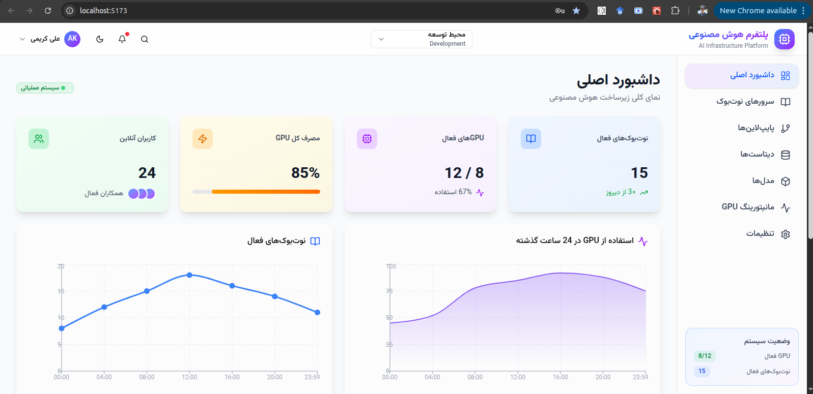
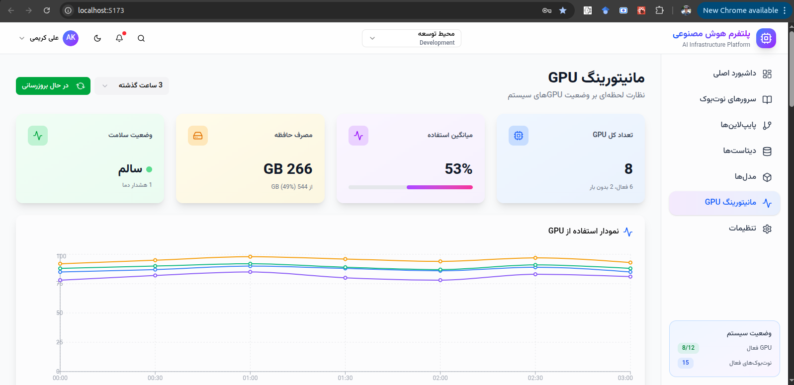
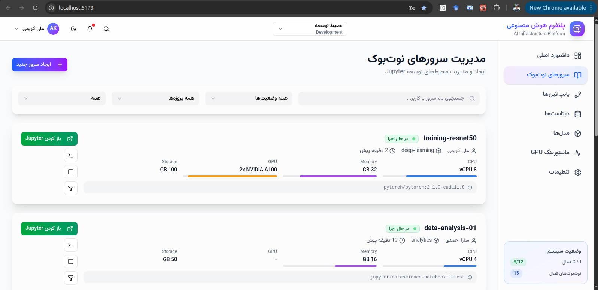
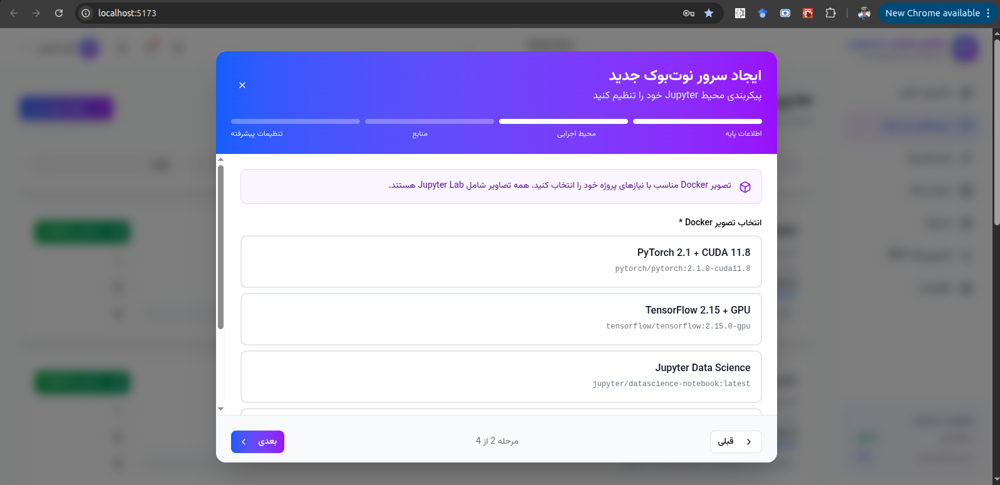
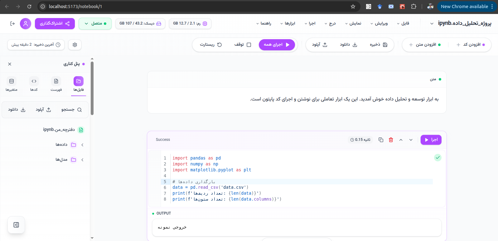

# Enterprise AI Platform Dashboard

## Screenshots

### Main Dashboard

### GPU Monitoring

### Notebooks List

### New Notebook

### Colab Jupyter

## Running the code

Run `yarn i` to install the dependencies.

Run `yarn run dev` to start the development server.